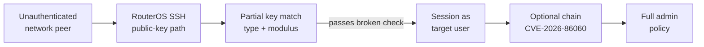
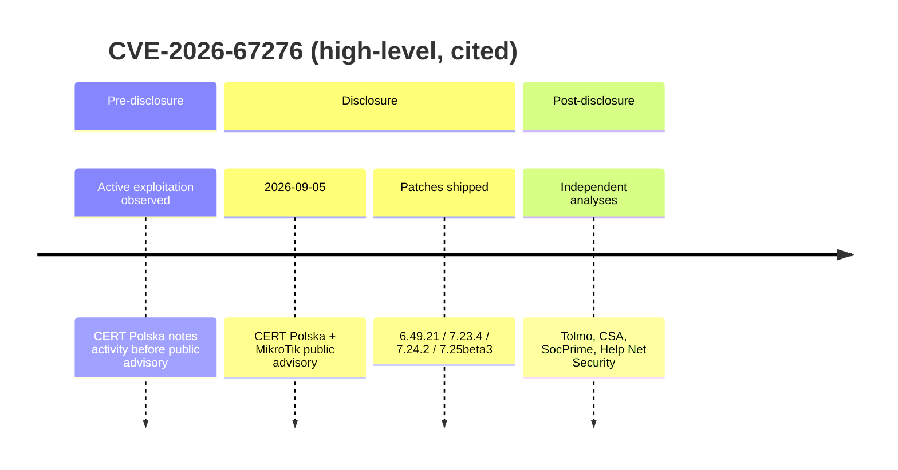
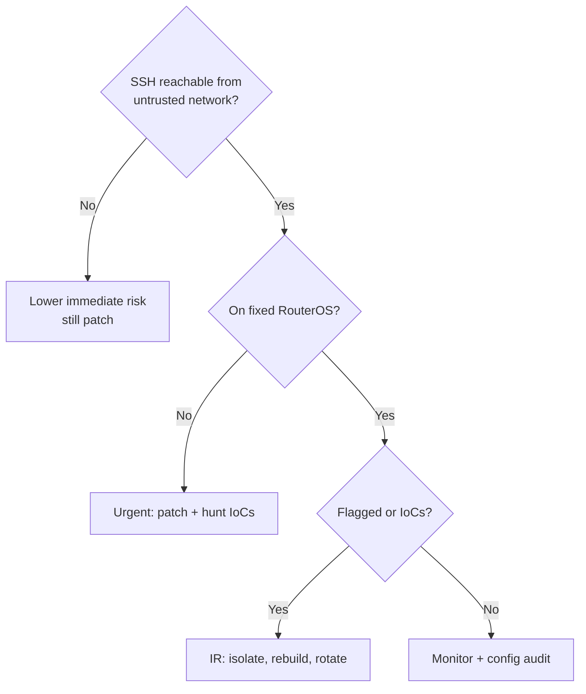

| **CVE** | CVE-2026-67276 |
| --- | --- |
| **CWE** | CWE-347 (Improper Verification of Cryptographic Signature) |
| **CVSS** | 9.2 Critical — `CVSS:4.0/AV:N/AC:H/AT:N/PR:N/UI:N/VC:H/VI:H/VA:H/SC:N/SI:N/SA:N` (CERT Polska / OpenCVE) |
| **EPSS** | Not published at time of writeup (n/a in OpenCVE) |
| **Vendor / Product** | MikroTik — RouterOS (SSH server / public-key authentication) |
| **Affected** | RouterOS builds older than fixed releases below (any device with RSA public-key SSH auth enabled) |
| **Fixed** | 6.49.21 (Long-term), 7.23.4 (Long-term), 7.24.2 (Stable), 7.25beta3+ |
| **Disclosure / public** | 2026-09-05 (CERT Polska coordinated disclosure with MikroTik) |
| **Status** | Patched; actively exploited before/around disclosure (MikroTrick chain). Not listed as this CVE in KEV at research time (related RouterOS issues appeared in KEV separately). |
| **Sources** | CERT Polska · MikroTik Sep 2026 bulletin · OpenCVE |

---

## Executive summary

CVE-2026-67276 is a critical SSH authentication bypass in MikroTik RouterOS. The SSH server matched authorized RSA keys on **key type and modulus** but omitted a complete check of the public exponent, and signature verification used client-supplied key material. An attacker who knows a valid username and the **public** modulus of that user’s authorized key can present a substitute key that passes the broken check — without the legitimate private key. Privileges match the impersonated account. Chained with **CVE-2026-86060** (username/policy escalation), the pair is known as **MikroTrick** and can yield full administrative takeover on internet-reachable SSH. CERT Polska reported in-the-wild activity around the September 2026 disclosure. Defenders should patch immediately, restrict SSH exposure, and hunt for IoCs such as user `-2` and rogue high-privilege accounts.

## Why this matters

- **Blast radius:** Routers terminate VPNs, enforce segmentation, and often hold long-lived credentials with little endpoint telemetry.
- **Who runs this:** SMB and ISP edge, enterprise branch routers, lab/home labs — millions of RouterOS instances historically appear in internet scans.
- **Attacker gain:** Impersonation of an existing SSH user; with the chain partner, full admin (scripts, tunnels, config rewrite, persistence).
- **Related CVEs:** CVE-2026-86060 (privilege escalation via username/policy handling); CVE-2026-67279 and other September 2026 RouterOS issues appear in the same CERT/MikroTik batch.

## Technical root cause

SSH public-key authentication must prove possession of the private key that matches the **entire** authorized public key (or a collision-resistant fingerprint of it). RouterOS performed an **incomplete identity comparison** — modulus-centric — so a different key sharing the known modulus could satisfy the matcher. Public moduli are not secrets; they appear in authorized_keys, backups, and provisioning artifacts.

**Trust boundary that failed:** Client-presented public key material was treated as authoritative for both identity match and signature verification, without binding to the full stored authorized key.

## Affected surface

- **Products:** MikroTik RouterOS with SSH enabled and RSA public-key authentication configured for one or more users.
- **Versions:** Builds prior to 6.49.21 / 7.23.4 / 7.24.2 / 7.25beta3 (confirm against MikroTik bulletin for your channel).
- **Prerequisites (high level):** Reachable SSH service; knowledge of a username and that user’s authorized RSA modulus; RSA key auth in use for the target account.
- **Configs that raise risk:** SSH exposed to the internet or untrusted WAN; shared or predictable key-generation practices that leak moduli.

## Impact model

| **Dimension** | **Alone** | **Chained (MikroTrick)** |
| --- | --- | --- |
| **Confidentiality** | High (as target user) | High (admin) |
| **Integrity** | High (as target user) | High (full config) |
| **Availability** | High possible | High |
| **Privilege** | Impersonated account | Full administrative policy |
| **Chaining** | Foothold for CVE-2026-86060 and post-auth abuse | Unauthenticated full takeover when SSH is reachable |

## Detection & hunting

- Centralize RouterOS logs (on-device logs are volatile).
- Alert on usernames starting with `-`, especially `-2`; history attribution like `ssh:-2@…`.
- Unexpected users (notably `ops` with full policy), new schedulers/scripts with fetch+import patterns, SOCKS/proxies, unexpected tunnels.
- After upgrade: `/system/device-mode/print` for `flagged: yes` (absence does **not** prove cleanliness).
- Bursts of SSH signature-verification failures or auth timeouts around campaign windows.

## Mitigation & hardening

1. **Patch** to 6.49.21, 7.23.4, 7.24.2, 7.25beta3, or later per MikroTik’s September 2026 bulletin.
2. **Until patched:** Restrict SSH to trusted management networks only; disable unnecessary exposure.
3. **If Flagged or IoCs present:** Isolate, preserve logs/config, factory-reset, rebuild from known-good config, **rotate all secrets** the device held. Do not blindly restore full backups from a compromised device.
4. Prefer full-key fingerprint verification patterns in any custom tooling; treat partial crypto equality as a design smell.

## Timeline

Exact discovery/vendor-notify dates beyond the public 2026-09-05 advisory are not fully enumerated in the research batch; treat pre-disclosure exploitation as **confirmed by CERT Polska**, not inferred.

## Credibility extras

- **Confirmed:** Incomplete RSA comparison (modulus without full key), CVSS 9.2, fixed versions, active exploitation narrative — CERT Polska, MikroTik bulletin, OpenCVE/CIRCL.
- **Inferred / secondary:** Exact EPSS (unpublished); some writeups mention additional session/rekey paths (CVE-2026-67279) — verify against primary advisories before teaching as core to this CVE.
- **Open questions:** How widely moduli were obtainable in the wild campaigns; whether non-RSA key types were in scope (primary sources focus on RSA).

## Visuals

See mermaid diagrams above (trust-boundary attack path + timeline). Optional exposure decision:

## References

1. CERT Polska — actively exploited RouterOS vulns / MikroTrick
2. CERT Polska — dedicated MikroTik CVE page
3. MikroTik September 2026 vulnerability bulletin
4. OpenCVE — CVE-2026-67276
5. Tolmo — MikroTrick agentic detection
6. Cloud Security Alliance — MikroTrick research note
7. SocPrime — CVE-2026-67276 analysis
